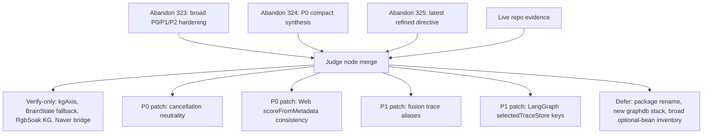
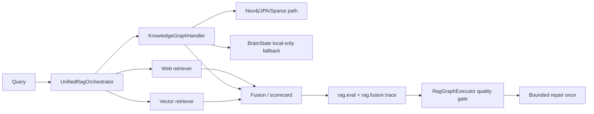
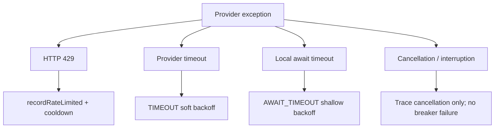

# Codex Source Patch Directive - Abandon 323-325 GraphRAG/KG Ops Judge Node

Generated: 2026-06-01 Asia/Seoul
Workspace: `C:\AbandonWare\demo-1\demo-1\src`

Use this as the source modification instruction sheet for the next Codex
patching agent. The Abandon files are design/risk input. The live checkout,
Gradle sourceSets, and command output decide what may be patched.

## Source Documents

- `C:\Users\nninn\Downloads\Abandon (323).txt`
  - Lines: 1071
  - Bytes: 38047
  - SHA256: `065907404F3C055E2F35A8B1D01AD4E499D6AA0CF01A0DA081F5DDD24AB454CC`
- `C:\Users\nninn\Downloads\Abandon (324).txt`
  - Lines: 881
  - Bytes: 30577
  - SHA256: `04C5E1822F431186A89457C3B9BD4C8DF3BF4D3257E1EB5B71C74EFE49C1485B`
- `C:\Users\nninn\Downloads\Abandon (325).txt`
  - Lines: 930
  - Bytes: 37535
  - SHA256: `579691B4ED5F5DEB621ED5382739A52B52C8E341D95FC8C98F6BBF4B32D16669`

## Judge Verdict

The three attachments are not three independent feature tracks. They are one
GraphRAG/KG operations-hardening plan at different refinement levels:

- `325` is the cleanest latest base.
- `324` is a compact P0-only synthesis.
- `323` contains useful P1/P2 expansion items, but several are already present
  in this checkout and must become verify-only.

Patch only the residual seams still contradicted by live source. Do not re-add
already-landed `kgAxis`, BrainState fallback, Naver bridge, RgbSoak KG variant,
or prompt-pack infrastructure.

Next single most urgent source patch:

> Make provider cancellation neutral in `ProviderRateLimitBackoffAspect`: do not
> call `recordFailure(... CANCELLED ...)` or start cooldown for Naver/Brave
> cancellation paths. Record redacted cancellation breadcrumbs only, return the
> existing fail-soft empty result, and add focused tests.

## Current Repo Evidence Snapshot

Observed in `C:\AbandonWare\demo-1\demo-1\src` before writing this directive:

- `.\gradlew.bat projects --no-daemon` succeeded.
  - Root project: `src111_merge15`
  - Included project: `:app`
- `.\gradlew.bat checkLangchain4jVersionPurity checkSourceSetHygiene --no-daemon`
  succeeded.
- `settings.gradle` includes `:app`; `:demo-1` and `:lms-core` are gated by
  `includeLegacyModules`.
- Root `build.gradle.kts` active backend source roots:
  - Java: `main/java`
  - Resources: `main/resources`
  - Tests: `src/test/java`
- `app/build.gradle.kts` active app shim roots:
  - Java: `app/src/main/java_clean`
  - Resources: `app/src/main/resources`
- LangChain4j remains pinned to `1.0.1` and the purity task exists.
- `git status --short` cannot be used here: this checkout is not a Git root.

## Already Landed - Treat As Verify-Only

- `UnifiedRagOrchestrator.extractMetadata(Content)` already merges
  `Content.metadata()` and `TextSegment.metadata()`.
- `UnifiedRagOrchestrator.toDocsFromContents(...)` and `toDocs(...)` already
  use `scoreFromMetadata(...)` with `kg_score` priority.
- `UnifiedRagOrchestrator` already emits `rag.eval.kgAxis` to response debug and
  `TraceStore`.
- `RagGraphExecutor` already has quality repair labels for `kg_starvation`,
  `kg_final_drop`, `source_collapse`, and `stage_drop_high`, and reads scorecard
  and threshold-break labels for quality-gate decisions.
- `RgbSoakReportService` already supports optional KG variants through
  `props.isKgVariantEnabled()`.
- `BrainStateService.querySparseInferenceLocalOnly(...)` already exists, and
  `KnowledgeGraphHandler` already calls it as a KG fallback.
- `NaverSearchService` already uses `NaverCredentialBridge`, keeps the
  `NAVER_KEYS`/`NAVER_CLIENT_ID`/`NAVER_CLIENT_SECRET` contract, and records
  provider-disabled diagnostics without printing key values.
- `DynamicRetrievalHandlerChain` already records a `rag.fusion.scorecard` with
  KG input/retention counts.

## Residual Patch Board

| Priority | Candidate | Live evidence | Risk if ignored | Patch size | Decision |
| --- | --- | --- | --- | --- | --- |
| P0 | Provider cancellation neutrality | `ProviderRateLimitBackoffAspect` still calls `recordFailure(... CANCELLED ...)` for Naver/Brave cancellation branches. | User/client cancellation can pollute provider breaker state and trigger false cooldown/starvation. | Small AOP method edit + focused tests. | patch |
| P0 | Web conversion score consistency | `UnifiedRagOrchestrator` standalone web loop still sets `d.score = 1.0 - rank` before `extractMetadata(c)`. | Web/provider scores can be lost even though KG/vector conversion was fixed. | Tiny local edit + extend existing orchestrator test. | patch |
| P1 | Exact KG fusion trace aliases | `rag.fusion.scorecard` exists, but exact keys `rag.fusion.sizes.kg`, `rag.fusion.weights.kg`, `rag.fusion.final.kgCount` are absent. | Operators/tests looking for those stable keys miss KG retention evidence. | Trace-only alias additions. | patch after P0 |
| P1 | LangGraph snapshot visibility | `qualityGateReason` reads response debug, but `selectedTraceStore()` omits `rag.eval.*` keys. | Node snapshots can hide why quality-gate repair fired. | Trace allowlist addition only. | patch after P0 |
| P2 | Optional bean/config/package inventory | Attachments ask for broader diagnostics. | Useful but not a blocker; high chance of noisy scope creep. | Separate doc or admin-only diagnostic pass. | defer |

## Conflict Resolution Board

| Topic | 323 | 324 | 325 | Judge decision |
| --- | --- | --- | --- | --- |
| Base document | Broad P0/P1/P2 list | P0 focused | Latest refined instruction | Use `325` as base, backfill only useful P1/P2 from `323`. |
| KG score preservation | Patch all conversion paths | Patch KG metadata/score | Same, more explicit | Already mostly landed; only standalone Web loop remains. |
| `rag.eval.kgAxis` | Add v2/v1 scorecard | Add scorecard | Add scorecard and LangGraph use | Already landed; verify and avoid duplicate metrics. |
| RgbSoak KG variant | Add KG variant | Add property-gated variant | Add property-gated variant | Already landed; verify only. |
| BrainState shadow/fallback | Mention as broader P1 | Not central | Shadow/local-only fallback | Already landed from previous pass; verify only. |
| Cancellation | Improve breaker/retry/cancel | Risk section | Explicitly not hard breaker | Live residual P0. |
| Naver keys | Preserve env names, no secrets | Same | Same | Verify-only unless leakage is found. |
| Package cleanup | Diagnostics only | Defer | Docs only | Defer, no package move. |

## Orchestration Blueprint

### Judge Merge Flow



### Runtime Target Shape



### Provider Failure Taxonomy



## Absolute Invariants

- Active backend owner is root `main/java` and `main/resources`.
- Active app shim owner is `app/src/main/java_clean` and `app/src/main/resources`.
- Treat `java/...`, `resources/...`, `project/src/main/java`,
  `app/src/main/java`, `demo-1`, `lms-core`, backups, archives, and generated
  build outputs as reference unless Gradle proves active ownership.
- Keep every `dev.langchain4j` dependency exactly `1.0.1`.
- Do not downgrade Spring Boot.
- Do not create a new `graphdb.*` stack, new graph controller, new provider
  framework, or duplicate prompt builder.
- Do not rename, delete, normalize, or restructure any `openssl` or `opnessl`
  key/value/name.
- Never log raw API keys, owner tokens, Authorization headers, client secrets,
  raw prompts, full env dumps, or raw sensitive queries.
- Missing optional external providers must produce provider-disabled state,
  explicit `disabledReason`, no outbound call, and redacted diagnostics.
- Final answer prompt construction must remain on
  `PromptBuilder.build(PromptContext)` or the repo-equivalent boundary.

## do01 / Observation

Commands to run first from repo root:

```powershell
Get-Location
Get-ChildItem -LiteralPath . -Filter 'settings.gradle*'
Get-ChildItem -LiteralPath . -Filter 'build.gradle*'
Get-ChildItem -LiteralPath app -Filter 'build.gradle*'
.\gradlew.bat projects --no-daemon
.\gradlew.bat checkLangchain4jVersionPurity checkSourceSetHygiene --no-daemon
rg -n "kg_score|rag\.eval\.kgAxis|scoreFromMetadata|CANCELLED|recordFailure|rag\.fusion\.scorecard|rag\.fusion\.sizes\.kg" main/java src/test/java
```

Expected observation:

- Source roots match `main/java`, `main/resources`, `app/src/main/java_clean`.
- LangChain4j purity passes.
- Existing KG score/axis tests are present under
  `src/test/java/com/example/lms/service/rag/orchestrator`.
- Residual cancellation branches are found in
  `main/java/ai/abandonware/nova/orch/aop/ProviderRateLimitBackoffAspect.java`.

## do02 / Patch Blocks

### Patch P0-01 - Neutralize Provider Cancellation

Target:

- `main/java/ai/abandonware/nova/orch/aop/ProviderRateLimitBackoffAspect.java`
- tests under `src/test/java/ai/abandonware/nova/orch/aop/` or the nearest
  existing provider-backoff test package.

Current wrong shape:

```java
if (isCancelled(t)) {
    backoff.recordFailure(PROVIDER_NAVER, FailureKind.CANCELLED, ...);
    Decision d2 = backoff.shouldSkip(PROVIDER_NAVER);
    markSkipped("naver", d2);
    return List.of();
}
```

Required shape:

```java
if (isCancelled(t)) {
    markCancelled("naver", t);
    return List.of();
}
```

For `SearchResult` return paths, preserve the existing empty result object.
For Brave, preserve `BraveSearchResult.cooldown(...)` only if the type requires
it for caller compatibility, but do not call `recordFailure`, `shouldSkip`, or
write cooldown/skip markers caused by cancellation.

Add a small private helper:

```java
private static void markCancelled(String provider, Throwable t) {
    TraceStore.put("web." + provider + ".cancelled", true);
    TraceStore.inc("web." + provider + ".cancelled.count");
    TraceStore.put("web." + provider + ".cancelled.failureClass",
            t == null ? "" : t.getClass().getSimpleName());
}
```

Do not log the raw query or request body. This patch should emit only provider,
boolean/count, failure class, and timestamp if needed.

Focused tests:

- Cancellation does not call `recordFailure`.
- Cancellation does not call `recordRateLimited`.
- Cancellation sets `web.<provider>.cancelled` and returns fail-soft empty
  result.
- 429 and timeout behavior remains unchanged.

### Patch P0-02 - Finish Web Score Preservation

Target:

- `main/java/com/example/lms/service/rag/orchestrator/UnifiedRagOrchestrator.java`
- extend `UnifiedRagOrchestratorRagEvalTest`.

Current residual shape in the standalone Web loop:

```java
d.title = extractTitle(c.metadata(), "Web Result #" + (i + 1));
d.snippet = buildSnippet(c);
d.source = "WEB";
d.score = 1.0 - (i * 0.01);
d.meta = extractMetadata(c);
```

Required shape:

```java
d.meta = extractMetadata(c);
d.title = extractTitle(d.meta, "Web Result #" + (i + 1));
d.snippet = buildSnippet(c);
d.source = "WEB";
d.score = scoreFromMetadata(d.meta, 1.0 - (i * 0.01));
```

Also extend `scoreFromMetadata(...)` to consider `vector_score` after
`rrf_score` if the current repo still lacks that key:

```java
firstNonBlank(meta, "kg_score", "score", "rrf_score", "vector_score")
```

Do not change rank fallback behavior when no metadata score exists.

### Patch P1-01 - Add KG Fusion Trace Aliases

Target:

- `main/java/com/example/lms/service/rag/handler/DynamicRetrievalHandlerChain.java`
- existing `DynamicRetrievalHandlerChainSearchRecoveryTest` or a new focused
  trace test.

Current landed state:

- `rag.fusion.scorecard` already contains `kg`, `kgRetainedCount`,
  `kgInputShare`, and `kgRetainedShare`.

Add compatibility aliases, trace-only:

```java
TraceStore.put("rag.fusion.sizes.kg", kg);
TraceStore.put("rag.fusion.weights.kg", kg > 0 ? 1.0d : 0.0d);
TraceStore.put("rag.fusion.final.kgCount", retainedKg);
```

Do not create a new fusion service or change ranking behavior.

### Patch P1-02 - Add RAG Eval Keys To LangGraph Snapshots

Target:

- `main/java/com/example/lms/service/rag/langgraph/RagGraphExecutor.java`

Current landed state:

- `qualityGateReason(...)` already reads response debug `rag.eval.scorecard`
  and `rag.eval.thresholdBreaks`.
- `selectedTraceStore()` still snapshots only vector/prompt contamination keys.

Add the following keys to `selectedTraceStore()` allowlist:

- `rag.eval.kgAxis`
- `rag.eval.scorecard`
- `rag.eval.thresholdBreaks`
- `rag.eval.stageDrop`
- `rag.eval.sourceDiversity`
- `rag.eval.providerDisabledSignals`
- `rag.eval.zeroResultSignals`
- `rag.eval.afterFilterStarvationSignals`

This is diagnostic-only. It must not alter routing or repair decisions.

## do03 / Setup Commands

Run from `C:\AbandonWare\demo-1\demo-1\src`.

Core verification:

```powershell
.\gradlew.bat projects --no-daemon
.\gradlew.bat checkLangchain4jVersionPurity checkSourceSetHygiene --no-daemon
.\gradlew.bat compileJava --no-daemon -x test
```

Focused tests after P0:

```powershell
.\gradlew.bat test --tests "*UnifiedRagOrchestratorRagEvalTest" --no-daemon
.\gradlew.bat test --tests "*ProviderRateLimitBackoffAspect*" --no-daemon
```

Focused tests after P1:

```powershell
.\gradlew.bat test --tests "*DynamicRetrievalHandlerChainSearchRecoveryTest" --no-daemon
.\gradlew.bat test --tests "*RagGraphExecutor*" --no-daemon
```

Network/cache-dependent commands:

```powershell
.\gradlew.bat dependencyInsight --dependency dev.langchain4j --configuration compileClasspath --no-daemon
```

Commands requiring real external credentials:

```powershell
# Only when real non-placeholder NAVER credentials are configured locally:
.\gradlew.bat test --tests "*NaverSearchServiceCredentialBridgeTest" --no-daemon
```

Do not print secret values while running any verification.

## do04 / Verification

For every command, record:

- Command
- Expected success condition
- Observed result
- Failure classification
- Retry decision
- Remaining `evidence_needed`

Required success conditions:

- `projects`: root `src111_merge15` with `:app` only by default.
- LangChain/sourceSet gates: pass without mixed LangChain4j versions.
- `compileJava`: no compile errors from changed files.
- URO test: metadata score from Web/KG content survives into `Doc.score`.
- Provider test: cancellation does not increment provider failure/backoff.
- Fusion trace test: exact KG aliases and scorecard both exist.
- LangGraph test: selected trace snapshot contains RAG eval keys but no raw
  query, prompt, or secrets.

Failure classifier:

- `langchain4j-version-purity`
- `wrong-sourceset`
- `cannot-find-symbol`
- `prompt-rule-violation`
- `secret-leak-risk`
- `provider-cancel-counted-as-failure`
- `zero-result-after-filter`
- `timeout`
- `rate-limit`
- `other`

Retry only once per blocker class after a specific patch.

## do05 / Risks & Next Steps

- Counterexample: if a provider intentionally uses cancellation as a real
  upstream fault signal, neutralizing it could hide one class of provider
  failure. In this repo, cancellation is caller/local-budget behavior, so it
  should be traced but not counted as provider breaker failure.
- Decision factors: live source evidence, patch size, verification coverage.
- Confidence: H for cancellation neutrality and Web score consistency; M for
  fusion alias keys because existing `rag.fusion.scorecard` may already satisfy
  most consumers.
- Next single most urgent patch: `ProviderRateLimitBackoffAspect` cancellation
  neutrality with focused tests.
- Defer all package moves, new graphdb packages, new controllers, and broad
  optional-bean inventory until the P0 tests pass.

## Final Report Requirements For The Patching Codex

Return these sections:

1. `## 요약`
2. `## do01 / Observation`
3. `## do02 / Patch Blocks`
4. `## do03 / Setup Commands`
5. `## do04 / Verification`
6. `## do05 / Risks & Next Steps`

Never claim build, boot, test, provider, or router success without command
output. Always list changed files, diff summary, commands run, observed results,
web documentation consulted if any, `evidence_needed`, one limitation, and the
next single most urgent patch.
